# システムアーキテクチャ設計書

## プロジェクト概要

- **プロジェクト名**: とちまち（Tochimachi）
- **システム種別**: 地域ポータルサイト（栃木県特化）
- **作成日**: 2025-12-02
- **バージョン**: 1.0

---

## アーキテクチャ概要

### システム構成

とちまちは、**Next.js 14 App Router**をベースとしたモダンなフルスタックWebアプリケーションです。Server ComponentsとClient Componentsを適切に使い分け、パフォーマンスとユーザー体験を最適化します。

### 設計原則

1. **Server-First Architecture**: デフォルトでServer Componentsを使用
2. **Progressive Enhancement**: 段階的な機能拡張
3. **Separation of Concerns**: 責務の明確な分離
4. **API-First Design**: 外部統合を見据えたAPI設計
5. **Security by Default**: セキュリティをデフォルトで組み込み

---

## 全体アーキテクチャ図

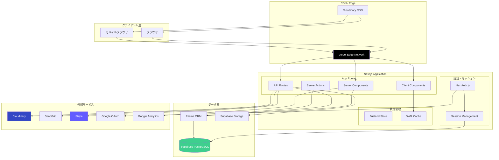

---

## レイヤーアーキテクチャ

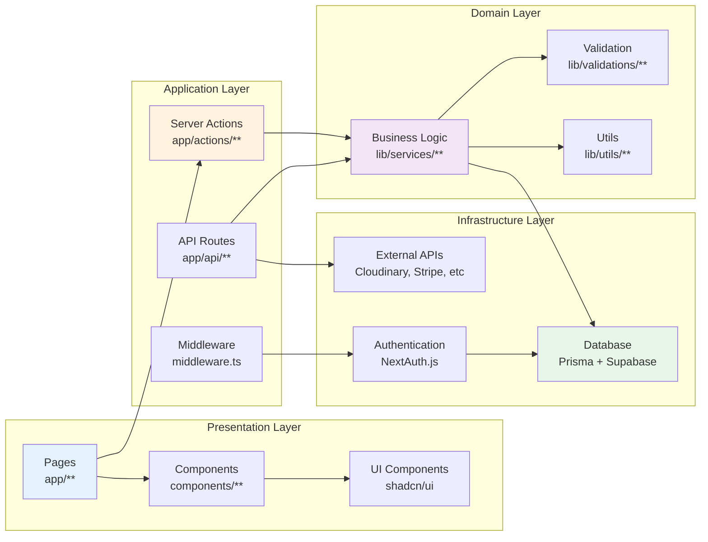

---

## ディレクトリ構造

```
tochimachi/
├── app/                          # Next.js App Router
│   ├── (auth)/                   # 認証関連グループ
│   │   ├── login/
│   │   │   └── page.tsx
│   │   ├── register/
│   │   │   └── page.tsx
│   │   └── layout.tsx
│   │
│   ├── (main)/                   # メインコンテンツグループ
│   │   ├── events/
│   │   │   ├── [id]/
│   │   │   │   └── page.tsx
│   │   │   └── page.tsx
│   │   ├── shops/
│   │   │   ├── [id]/
│   │   │   │   └── page.tsx
│   │   │   └── page.tsx
│   │   ├── news/
│   │   └── about/
│   │
│   ├── (admin)/                  # 管理画面グループ
│   │   ├── dashboard/
│   │   ├── events/
│   │   └── layout.tsx
│   │
│   ├── api/                      # API Routes
│   │   ├── auth/
│   │   │   └── [...nextauth]/
│   │   │       └── route.ts
│   │   ├── events/
│   │   │   └── route.ts
│   │   ├── shops/
│   │   │   └── route.ts
│   │   ├── upload/
│   │   │   └── route.ts
│   │   └── webhooks/
│   │       └── stripe/
│   │           └── route.ts
│   │
│   ├── actions/                  # Server Actions
│   │   ├── events.ts
│   │   ├── shops.ts
│   │   └── auth.ts
│   │
│   ├── layout.tsx                # Root Layout
│   ├── page.tsx                  # Home Page
│   ├── not-found.tsx
│   ├── error.tsx
│   └── loading.tsx
│
├── components/                   # Reactコンポーネント
│   ├── ui/                       # shadcn/ui コンポーネント
│   │   ├── button.tsx
│   │   ├── card.tsx
│   │   ├── dialog.tsx
│   │   └── ...
│   │
│   ├── layouts/                  # レイアウトコンポーネント
│   │   ├── header.tsx
│   │   ├── footer.tsx
│   │   └── sidebar.tsx
│   │
│   ├── events/                   # イベント関連
│   │   ├── event-card.tsx
│   │   ├── event-list.tsx
│   │   └── event-form.tsx
│   │
│   ├── shops/                    # お店関連
│   │   ├── shop-card.tsx
│   │   ├── shop-list.tsx
│   │   └── shop-form.tsx
│   │
│   └── common/                   # 共通コンポーネント
│       ├── loading-spinner.tsx
│       ├── error-message.tsx
│       └── pagination.tsx
│
├── lib/                          # ビジネスロジック・ユーティリティ
│   ├── prisma.ts                 # Prismaクライアント
│   ├── auth.ts                   # NextAuth設定
│   │
│   ├── services/                 # ビジネスロジック
│   │   ├── event-service.ts
│   │   ├── shop-service.ts
│   │   └── user-service.ts
│   │
│   ├── validations/              # Zodバリデーション
│   │   ├── event-schema.ts
│   │   ├── shop-schema.ts
│   │   └── user-schema.ts
│   │
│   ├── utils/                    # ユーティリティ関数
│   │   ├── cn.ts                 # Tailwindクラス結合
│   │   ├── format.ts             # 日付・文字列フォーマット
│   │   └── api.ts                # API呼び出しヘルパー
│   │
│   └── constants/                # 定数
│       ├── categories.ts
│       └── regions.ts
│
├── prisma/                       # Prisma関連
│   ├── schema.prisma             # データベーススキーマ
│   ├── migrations/               # マイグレーション履歴
│   └── seed.ts                   # シードデータ
│
├── public/                       # 静的ファイル
│   ├── images/
│   ├── icons/
│   └── fonts/
│
├── tests/                        # テスト
│   ├── unit/
│   ├── integration/
│   └── e2e/
│
├── docs/                         # ドキュメント
│   ├── architecture/
│   │   ├── TECH_STACK.md
│   │   └── SYSTEM_ARCHITECTURE.md
│   └── api/
│
├── .github/                      # GitHub設定
│   ├── workflows/
│   └── labels.yml
│
├── .env.local                    # 環境変数
├── .env.example
├── next.config.mjs               # Next.js設定
├── tailwind.config.ts            # Tailwind設定
├── tsconfig.json                 # TypeScript設定
├── package.json
└── README.md
```

---

## データベース設計

### ER図

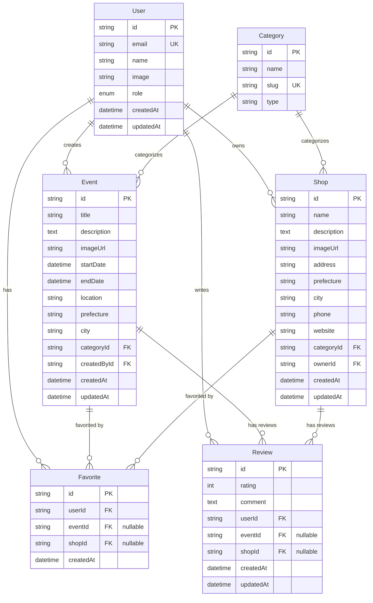

### Prismaスキーマ例

```prisma
model User {
  id            String    @id @default(cuid())
  email         String    @unique
  name          String?
  image         String?
  role          Role      @default(USER)
  events        Event[]
  shops         Shop[]
  favorites     Favorite[]
  reviews       Review[]
  createdAt     DateTime  @default(now())
  updatedAt     DateTime  @updatedAt
}

enum Role {
  USER
  SHOP_OWNER
  EVENT_ORGANIZER
  ADMIN
}

model Event {
  id            String    @id @default(cuid())
  title         String
  description   String    @db.Text
  imageUrl      String?
  startDate     DateTime
  endDate       DateTime
  location      String
  prefecture    String
  city          String
  category      Category  @relation(fields: [categoryId], references: [id])
  categoryId    String
  createdBy     User      @relation(fields: [createdById], references: [id])
  createdById   String
  favorites     Favorite[]
  reviews       Review[]
  createdAt     DateTime  @default(now())
  updatedAt     DateTime  @updatedAt
}

model Shop {
  id            String    @id @default(cuid())
  name          String
  description   String    @db.Text
  imageUrl      String?
  address       String
  prefecture    String
  city          String
  phone         String?
  website       String?
  category      Category  @relation(fields: [categoryId], references: [id])
  categoryId    String
  owner         User      @relation(fields: [ownerId], references: [id])
  ownerId       String
  favorites     Favorite[]
  reviews       Review[]
  createdAt     DateTime  @default(now())
  updatedAt     DateTime  @updatedAt
}

model Category {
  id        String   @id @default(cuid())
  name      String
  slug      String   @unique
  type      String   // "event" or "shop"
  events    Event[]
  shops     Shop[]
}
```

---

## API設計

### API Routes構成

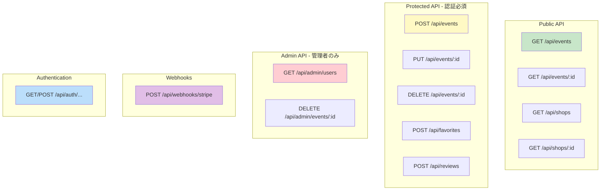

### エンドポイント一覧

#### イベント関連

| メソッド | エンドポイント    | 説明             | 認証           |
| -------- | ----------------- | ---------------- | -------------- |
| GET      | `/api/events`     | イベント一覧取得 | 不要           |
| GET      | `/api/events/:id` | イベント詳細取得 | 不要           |
| POST     | `/api/events`     | イベント作成     | 必要           |
| PUT      | `/api/events/:id` | イベント更新     | 必要（作成者） |
| DELETE   | `/api/events/:id` | イベント削除     | 必要（作成者） |

#### お店関連

| メソッド | エンドポイント   | 説明         | 認証             |
| -------- | ---------------- | ------------ | ---------------- |
| GET      | `/api/shops`     | お店一覧取得 | 不要             |
| GET      | `/api/shops/:id` | お店詳細取得 | 不要             |
| POST     | `/api/shops`     | お店登録     | 必要             |
| PUT      | `/api/shops/:id` | お店情報更新 | 必要（オーナー） |
| DELETE   | `/api/shops/:id` | お店削除     | 必要（オーナー） |

#### お気に入り関連

| メソッド | エンドポイント       | 説明           | 認証 |
| -------- | -------------------- | -------------- | ---- |
| GET      | `/api/favorites`     | お気に入り一覧 | 必要 |
| POST     | `/api/favorites`     | お気に入り追加 | 必要 |
| DELETE   | `/api/favorites/:id` | お気に入り削除 | 必要 |

#### レビュー関連

| メソッド | エンドポイント     | 説明         | 認証           |
| -------- | ------------------ | ------------ | -------------- |
| GET      | `/api/reviews`     | レビュー一覧 | 不要           |
| POST     | `/api/reviews`     | レビュー投稿 | 必要           |
| PUT      | `/api/reviews/:id` | レビュー編集 | 必要（作成者） |
| DELETE   | `/api/reviews/:id` | レビュー削除 | 必要（作成者） |

---

## 認証フロー

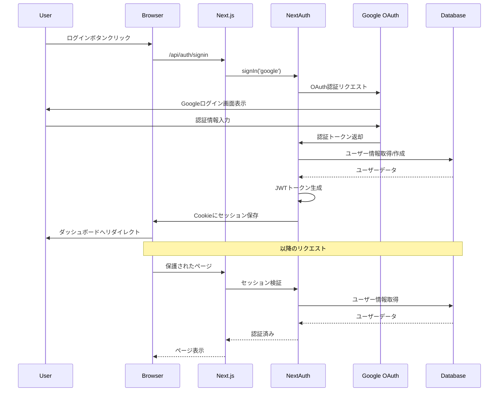

---

## データフロー

### Server Component データフロー

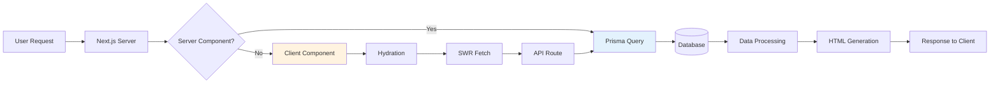

### クライアント側データフロー

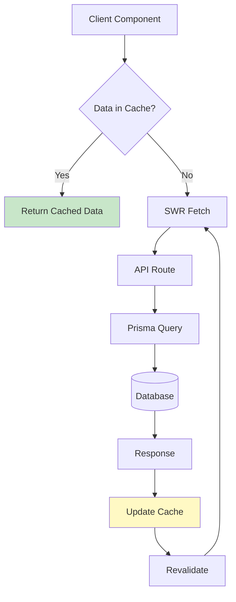

---

## デプロイメント構成

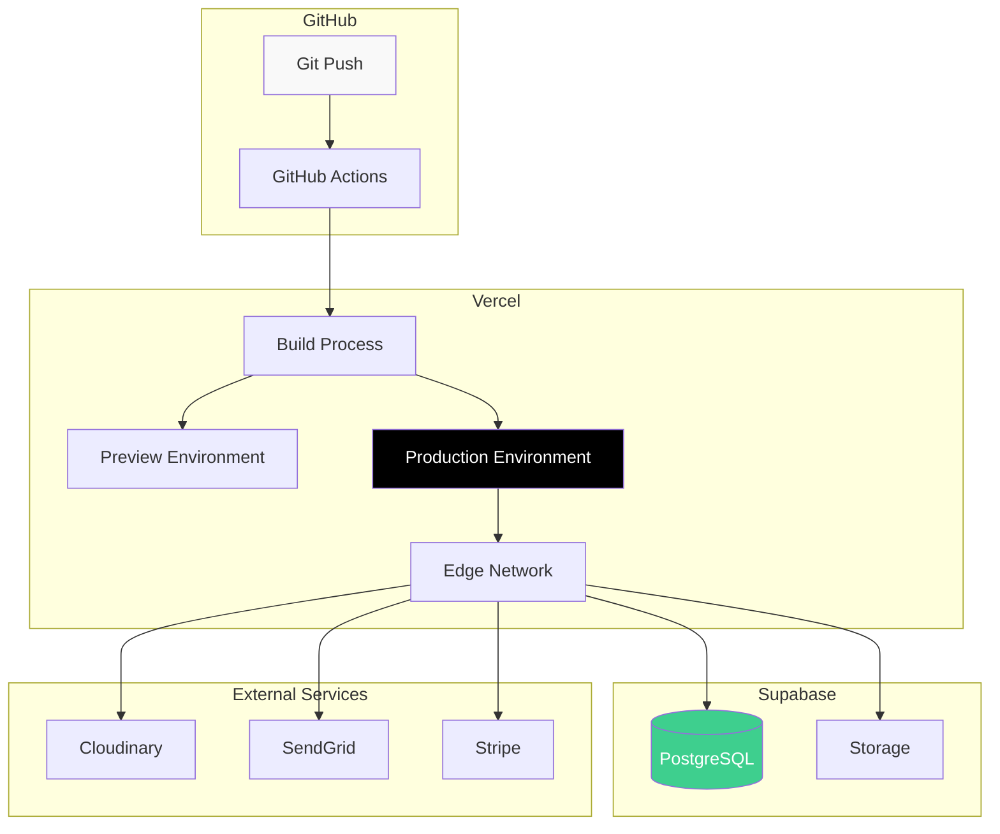

### デプロイメントフロー

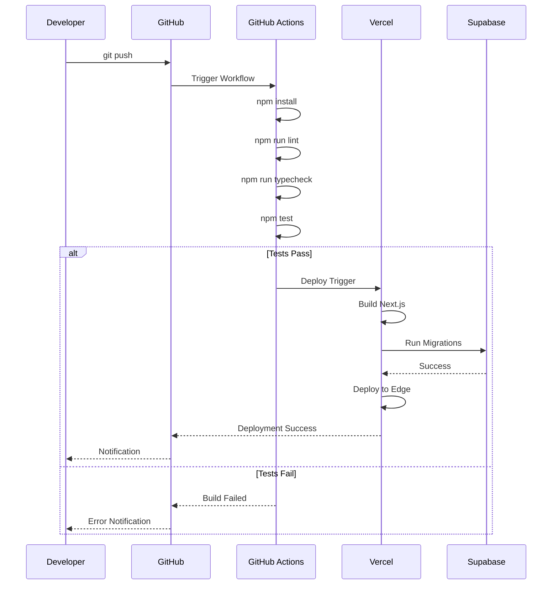

---

## セキュリティアーキテクチャ

### セキュリティレイヤー

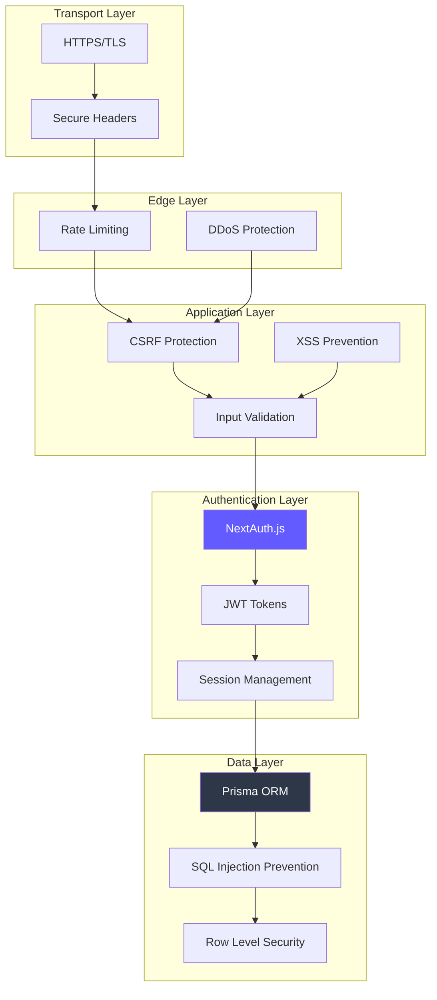

### 認可フロー

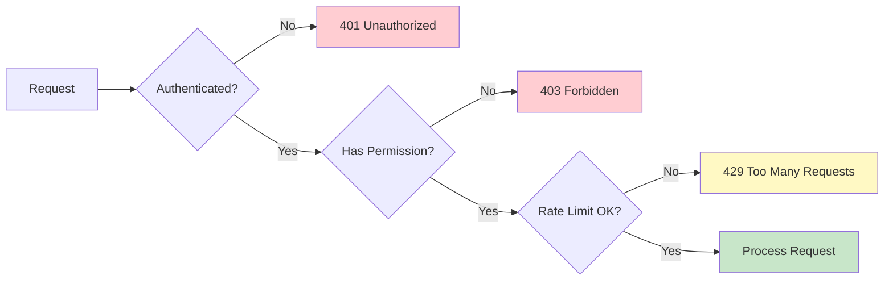

---

## パフォーマンス最適化戦略

### キャッシング戦略

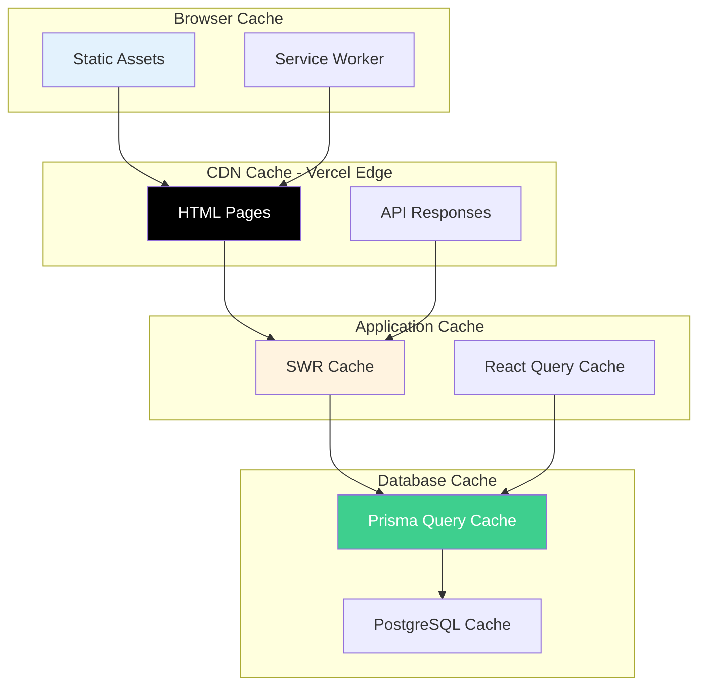

### レンダリング戦略

| ページタイプ   | レンダリング方式 | 理由                                       |
| -------------- | ---------------- | ------------------------------------------ |
| ホームページ   | ISR (60秒)       | 新規イベント反映とパフォーマンスのバランス |
| イベント一覧   | SSR              | リアルタイム性重視                         |
| イベント詳細   | SSG (fallback)   | SEO最適化                                  |
| お店一覧       | SSR              | 検索・フィルタ機能                         |
| お店詳細       | SSG (fallback)   | SEO最適化                                  |
| ダッシュボード | CSR              | 認証必須、動的データ                       |
| 管理画面       | CSR              | 認証必須、リアルタイム                     |

---

## モニタリング・ログ

### 監視対象メトリクス

```mermaid
graph TB
    subgraph "Frontend Metrics"
        A[Core Web Vitals]
        B[Page Load Time]
        C[JS Bundle Size]
    end

    subgraph "Backend Metrics"
        D[API Response Time]
        E[Database Query Time]
        F[Error Rate]
    end

    subgraph "Business Metrics"
        G[User Sign-ups]
        H[Event Creations]
        I[Review Submissions]
    end

    subgraph "Infrastructure Metrics"
        J[Server CPU/Memory]
        K[Database Connections]
        L[CDN Bandwidth]
    end

    A --> M[Vercel Analytics]
    B --> M
    C --> M
    D --> N[Custom Logging]
    E --> N
    F --> N
    G --> O[Google Analytics]
    H --> O
    I --> O
    J --> P[Vercel Dashboard]
    K --> P
    L --> P

    style M fill:#000000,color:#ffffff
    style O fill:#4285F4,color:#ffffff
```

---

## スケーラビリティ計画

### 成長段階別アーキテクチャ

#### Phase 1: MVP（0-1,000 MAU）

- **現在のアーキテクチャ**: Vercel + Supabase Free Tier
- **コスト**: $0-50/月
- **パフォーマンス**: 十分

#### Phase 2: 成長期（1,000-10,000 MAU）

- **Supabase**: Pro Tier ($25/月)
- **Vercel**: Pro Tier ($20/月)
- **追加**: Redis Cache（Upstash）
- **コスト**: $50-150/月

#### Phase 3: スケール期（10,000+ MAU）

- **Database**: 読み取りレプリカ追加
- **Cache**: Redis Cluster
- **CDN**: 追加最適化
- **API**: Rate Limiting強化
- **コスト**: $200-500/月

---

## 災害対策・バックアップ

### バックアップ戦略

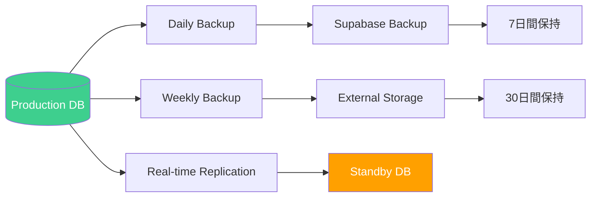

### 復旧時間目標（RTO/RPO）

| サービス            | RTO   | RPO    | 対策                     |
| ------------------- | ----- | ------ | ------------------------ |
| Webアプリケーション | 1時間 | 5分    | Vercel自動復旧           |
| データベース        | 4時間 | 24時間 | Supabase自動バックアップ |
| ファイルストレージ  | 2時間 | 24時間 | Cloudinary冗長化         |

---

## 今後の拡張計画

### Phase 2 機能拡張（6ヶ月以内）

- [ ] モバイルアプリ（React Native）
- [ ] リアルタイム通知（WebSocket）
- [ ] AIレコメンデーション
- [ ] 多言語対応（i18n）

### Phase 3 技術拡張（1年以内）

- [ ] Microservices化
- [ ] GraphQL API
- [ ] Elasticsearch（全文検索）
- [ ] Machine Learning（パーソナライゼーション）

---

## 参考資料

- [Next.js Architecture](https://nextjs.org/docs/architecture)
- [Vercel Edge Network](https://vercel.com/docs/edge-network/overview)
- [Supabase Architecture](https://supabase.com/docs/guides/platform/architecture)
- [Prisma Best Practices](https://www.prisma.io/docs/guides/performance-and-optimization)

---

**作成者**: CodeGenAgent (源)
**作成日**: 2025-12-02
**承認者**: -
**レビュー予定日**: 2025-03-02
