# とちまち データベース設計

## 概要

300社限定のB2B2Cプラットフォーム「とちまち」のデータベース設計書です。

### 主要機能

- 顧客ユーザー管理
- 登録業者管理（300社限定）
- サービス・料金メニュー管理
- 問い合わせ・カート機能
- 月額課金管理（12万円/月）
- Instagram連携

---

## ER図

```mermaid
erDiagram
    %% ========================================
    %% ユーザー・認証関連
    %% ========================================
    Users ||--o{ Inquiries : "creates"
    Users ||--o{ InquiryItems : "adds to cart"
    Users {
        string id PK "UUID"
        string email "unique, indexed"
        string passwordHash "hashed password"
        string name "full name"
        string phone "nullable"
        string prefecture "栃木県の市町村"
        datetime createdAt "default: now()"
        datetime updatedAt "auto-update"
        datetime lastLoginAt "nullable"
        boolean isActive "default: true"
    }

    %% ========================================
    %% 業者・サービス関連
    %% ========================================
    Vendors ||--|| VendorProfiles : "has"
    Vendors ||--o{ Services : "offers"
    Vendors ||--o{ Inquiries : "receives"
    Vendors ||--|| Subscriptions : "has"
    Vendors ||--o| InstagramAccounts : "may link"
    Vendors }|--|| Categories : "belongs to"

    Vendors {
        string id PK "UUID"
        string email "unique, indexed"
        string passwordHash "hashed password"
        string companyName "company name"
        string categoryId FK "業種カテゴリ"
        boolean isActive "default: true"
        datetime approvedAt "nullable - 審査承認日"
        datetime createdAt "default: now()"
        datetime updatedAt "auto-update"
        int displayOrder "表示順（1-300）"
    }

    VendorProfiles {
        string id PK "UUID"
        string vendorId FK "unique"
        text description "事業説明"
        string logoUrl "nullable"
        string coverImageUrl "nullable"
        json businessHours "営業時間 JSON"
        string address "住所"
        string mapUrl "Google Maps URL nullable"
        string websiteUrl "nullable"
        string contactPhone "問い合わせ電話"
        json gallery "画像ギャラリー JSON array"
        datetime createdAt "default: now()"
        datetime updatedAt "auto-update"
    }

    Categories {
        string id PK "UUID"
        string name "unique - カテゴリ名"
        string slug "unique - URL slug"
        text description "nullable"
        string iconUrl "nullable"
        int displayOrder "表示順"
        datetime createdAt "default: now()"
    }

    Services {
        string id PK "UUID"
        string vendorId FK
        string name "サービス名"
        text description "説明"
        decimal price "料金（円）"
        string unit "単位（例：1時間、1回）"
        int duration "所要時間（分） nullable"
        boolean isActive "default: true"
        datetime createdAt "default: now()"
        datetime updatedAt "auto-update"
    }

    %% ========================================
    %% 問い合わせ・カート関連
    %% ========================================
    Inquiries ||--o{ InquiryItems : "contains"

    Inquiries {
        string id PK "UUID"
        string userId FK "nullable for guest"
        string vendorId FK "indexed"
        string status "enum: draft, submitted, replied, closed"
        string guestName "nullable - ゲスト名"
        string guestEmail "nullable - ゲストメール"
        string guestPhone "nullable - ゲスト電話"
        text message "問い合わせメッセージ"
        text vendorReply "nullable - 業者返信"
        datetime repliedAt "nullable"
        datetime submittedAt "nullable"
        datetime createdAt "default: now()"
        datetime updatedAt "auto-update"
    }

    InquiryItems {
        string id PK "UUID"
        string inquiryId FK "indexed"
        string serviceId FK "nullable - サービス削除対応"
        string serviceName "スナップショット"
        decimal servicePrice "スナップショット"
        int quantity "default: 1"
        text note "nullable - 備考"
        datetime createdAt "default: now()"
    }

    %% ========================================
    %% 課金・サブスクリプション
    %% ========================================
    Subscriptions {
        string id PK "UUID"
        string vendorId FK "unique"
        string plan "enum: standard"
        decimal monthlyFee "12万円固定"
        string status "enum: active, suspended, cancelled"
        datetime currentPeriodStart "課金期間開始"
        datetime currentPeriodEnd "課金期間終了"
        datetime nextBillingDate "次回課金日"
        datetime cancelledAt "nullable"
        json paymentHistory "過去の支払い履歴 JSON"
        datetime createdAt "default: now()"
        datetime updatedAt "auto-update"
    }

    %% ========================================
    %% SNS連携
    %% ========================================
    InstagramAccounts {
        string id PK "UUID"
        string vendorId FK "unique"
        string instagramUsername "Instagram username"
        string accessToken "nullable - encrypted"
        datetime lastSyncAt "nullable"
        json syncedPosts "投稿データ JSON nullable"
        boolean isActive "default: true"
        datetime createdAt "default: now()"
        datetime updatedAt "auto-update"
    }

    %% ========================================
    %% 管理者
    %% ========================================
    Admins {
        string id PK "UUID"
        string email "unique"
        string passwordHash "hashed password"
        string name "管理者名"
        string role "enum: super_admin, admin, viewer"
        boolean isActive "default: true"
        datetime lastLoginAt "nullable"
        datetime createdAt "default: now()"
        datetime updatedAt "auto-update"
    }
```



---

## テーブル詳細仕様

### 1. Users（顧客ユーザー）

**用途**: 一般顧客の会員情報管理

| カラム名     | 型       | 制約                    | 説明                         |
| ------------ | -------- | ----------------------- | ---------------------------- |
| id           | UUID     | PK                      | 主キー                       |
| email        | String   | UNIQUE, NOT NULL, INDEX | メールアドレス（ログインID） |
| passwordHash | String   | NOT NULL                | bcrypt/argon2でハッシュ化    |
| name         | String   | NOT NULL                | 氏名                         |
| phone        | String   | NULL                    | 電話番号                     |
| prefecture   | String   | NOT NULL                | 栃木県内の市町村             |
| createdAt    | DateTime | DEFAULT NOW             | 登録日時                     |
| updatedAt    | DateTime | AUTO UPDATE             | 更新日時                     |
| lastLoginAt  | DateTime | NULL                    | 最終ログイン日時             |
| isActive     | Boolean  | DEFAULT true            | アカウント有効/無効          |

**インデックス**:

- `email` (UNIQUE)
- `createdAt` (降順 - 新規会員分析用)

---

### 2. Vendors（登録業者）

**用途**: 300社限定の登録業者管理

| カラム名     | 型       | 制約                      | 説明                        |
| ------------ | -------- | ------------------------- | --------------------------- |
| id           | UUID     | PK                        | 主キー                      |
| email        | String   | UNIQUE, NOT NULL, INDEX   | 業者メールアドレス          |
| passwordHash | String   | NOT NULL                  | パスワードハッシュ          |
| companyName  | String   | NOT NULL, INDEX           | 会社名                      |
| categoryId   | UUID     | FK → Categories, NOT NULL | 業種カテゴリ                |
| isActive     | Boolean  | DEFAULT true              | 営業中/休止中               |
| approvedAt   | DateTime | NULL                      | 審査承認日時（NULL=審査中） |
| createdAt    | DateTime | DEFAULT NOW               | 登録申請日時                |
| updatedAt    | DateTime | AUTO UPDATE               | 更新日時                    |
| displayOrder | Int      | NOT NULL, UNIQUE          | 表示順（1-300）             |

**インデックス**:

- `email` (UNIQUE)
- `categoryId` (問い合わせ検索用)
- `displayOrder` (一覧表示用)
- `approvedAt, isActive` (複合 - アクティブ業者検索)

**制約**:

- 最大300社（アプリケーション層で制御）
- displayOrderは1-300の連番

---

### 3. VendorProfiles（業者プロフィール）

**用途**: 業者の詳細情報・プロフィールページ

| カラム名      | 型       | 制約                           | 説明                                  |
| ------------- | -------- | ------------------------------ | ------------------------------------- |
| id            | UUID     | PK                             | 主キー                                |
| vendorId      | UUID     | FK → Vendors, UNIQUE, NOT NULL | 業者ID（1:1）                         |
| description   | Text     | NULL                           | 事業内容・PR文                        |
| logoUrl       | String   | NULL                           | ロゴ画像URL                           |
| coverImageUrl | String   | NULL                           | カバー画像URL                         |
| businessHours | JSON     | NULL                           | 営業時間（例: `{"mon":"9:00-18:00"}`) |
| address       | String   | NOT NULL                       | 所在地                                |
| mapUrl        | String   | NULL                           | Google Maps埋め込みURL                |
| websiteUrl    | String   | NULL                           | 公式Webサイト                         |
| contactPhone  | String   | NOT NULL                       | 問い合わせ電話番号                    |
| gallery       | JSON     | NULL                           | 画像ギャラリー（配列）                |
| createdAt     | DateTime | DEFAULT NOW                    | 作成日時                              |
| updatedAt     | DateTime | AUTO UPDATE                    | 更新日時                              |

**インデックス**:

- `vendorId` (UNIQUE - 1:1リレーション保証)

---

### 4. Categories（業種カテゴリ）

**用途**: 業種分類（建設/飲食/小売など）

| カラム名     | 型       | 制約             | 説明                              |
| ------------ | -------- | ---------------- | --------------------------------- |
| id           | UUID     | PK               | 主キー                            |
| name         | String   | UNIQUE, NOT NULL | カテゴリ名（例：建設業）          |
| slug         | String   | UNIQUE, NOT NULL | URL用スラッグ（例：construction） |
| description  | Text     | NULL             | カテゴリ説明                      |
| iconUrl      | String   | NULL             | アイコン画像URL                   |
| displayOrder | Int      | NOT NULL         | 表示順                            |
| createdAt    | DateTime | DEFAULT NOW      | 作成日時                          |

**インデックス**:

- `name` (UNIQUE)
- `slug` (UNIQUE)
- `displayOrder` (並び順用)

**初期データ例**:

```json
[
  { "name": "建設業", "slug": "construction", "displayOrder": 1 },
  { "name": "飲食業", "slug": "restaurant", "displayOrder": 2 },
  { "name": "小売業", "slug": "retail", "displayOrder": 3 }
]
```

---

### 5. Services（サービス・料金メニュー）

**用途**: 各業者が提供するサービス内容と料金

| カラム名    | 型       | 制約                          | 説明                   |
| ----------- | -------- | ----------------------------- | ---------------------- |
| id          | UUID     | PK                            | 主キー                 |
| vendorId    | UUID     | FK → Vendors, NOT NULL, INDEX | 提供業者               |
| name        | String   | NOT NULL                      | サービス名             |
| description | Text     | NULL                          | 詳細説明               |
| price       | Decimal  | NOT NULL                      | 料金（円）             |
| unit        | String   | NOT NULL                      | 単位（例：1時間、1回） |
| duration    | Int      | NULL                          | 所要時間（分）         |
| isActive    | Boolean  | DEFAULT true                  | 提供中/停止中          |
| createdAt   | DateTime | DEFAULT NOW                   | 作成日時               |
| updatedAt   | DateTime | AUTO UPDATE                   | 更新日時               |

**インデックス**:

- `vendorId` (業者のサービス一覧取得用)
- `vendorId, isActive` (複合 - アクティブサービス検索)

---

### 6. Inquiries（問い合わせ）

**用途**: 顧客からの問い合わせ管理（カート機能含む）

| カラム名    | 型       | 制約                          | 説明                                         |
| ----------- | -------- | ----------------------------- | -------------------------------------------- |
| id          | UUID     | PK                            | 主キー                                       |
| userId      | UUID     | FK → Users, NULL, INDEX       | 会員の場合のユーザーID                       |
| vendorId    | UUID     | FK → Vendors, NOT NULL, INDEX | 問い合わせ先業者                             |
| status      | Enum     | NOT NULL                      | ステータス（draft/submitted/replied/closed） |
| guestName   | String   | NULL                          | ゲストユーザー名                             |
| guestEmail  | String   | NULL                          | ゲストメールアドレス                         |
| guestPhone  | String   | NULL                          | ゲスト電話番号                               |
| message     | Text     | NOT NULL                      | 問い合わせ本文                               |
| vendorReply | Text     | NULL                          | 業者からの返信                               |
| repliedAt   | DateTime | NULL                          | 返信日時                                     |
| submittedAt | DateTime | NULL                          | 送信日時                                     |
| createdAt   | DateTime | DEFAULT NOW                   | 作成日時（カート作成）                       |
| updatedAt   | DateTime | AUTO UPDATE                   | 更新日時                                     |

**ステータス定義**:

- `draft`: カート状態（未送信）
- `submitted`: 送信済み（業者未返信）
- `replied`: 業者返信済み
- `closed`: 完了・クローズ

**インデックス**:

- `userId` (会員の問い合わせ履歴用)
- `vendorId, status` (複合 - 業者の未返信問い合わせ検索)
- `guestEmail` (ゲストユーザー追跡用)

---

### 7. InquiryItems（問い合わせ明細）

**用途**: 問い合わせに含まれるサービスアイテム（カート機能）

| カラム名     | 型       | 制約                            | 説明                             |
| ------------ | -------- | ------------------------------- | -------------------------------- |
| id           | UUID     | PK                              | 主キー                           |
| inquiryId    | UUID     | FK → Inquiries, NOT NULL, INDEX | 問い合わせID                     |
| serviceId    | UUID     | FK → Services, NULL             | サービスID（削除対応でNULL許可） |
| serviceName  | String   | NOT NULL                        | サービス名（スナップショット）   |
| servicePrice | Decimal  | NOT NULL                        | 料金（スナップショット）         |
| quantity     | Int      | DEFAULT 1                       | 数量                             |
| note         | Text     | NULL                            | 備考・要望                       |
| createdAt    | DateTime | DEFAULT NOW                     | カート追加日時                   |

**インデックス**:

- `inquiryId` (問い合わせ明細取得用)
- `serviceId` (サービス別問い合わせ分析用)

**設計メモ**:

- サービス削除時もデータ保持のため、名前・料金をスナップショット化

---

### 8. Subscriptions（月額課金情報）

**用途**: 業者の月額12万円課金管理

| カラム名           | 型       | 制約                           | 説明                                     |
| ------------------ | -------- | ------------------------------ | ---------------------------------------- |
| id                 | UUID     | PK                             | 主キー                                   |
| vendorId           | UUID     | FK → Vendors, UNIQUE, NOT NULL | 業者ID（1:1）                            |
| plan               | Enum     | NOT NULL                       | プラン種別（現在はstandard固定）         |
| monthlyFee         | Decimal  | NOT NULL                       | 月額料金（120,000円）                    |
| status             | Enum     | NOT NULL                       | ステータス（active/suspended/cancelled） |
| currentPeriodStart | DateTime | NOT NULL                       | 現在の課金期間開始日                     |
| currentPeriodEnd   | DateTime | NOT NULL                       | 現在の課金期間終了日                     |
| nextBillingDate    | DateTime | NOT NULL                       | 次回課金日                               |
| cancelledAt        | DateTime | NULL                           | 解約日時                                 |
| paymentHistory     | JSON     | NULL                           | 過去の支払い履歴（配列）                 |
| createdAt          | DateTime | DEFAULT NOW                    | 契約開始日時                             |
| updatedAt          | DateTime | AUTO UPDATE                    | 更新日時                                 |

**プラン定義**:

- `standard`: 月額12万円（300社限定プラン）

**ステータス定義**:

- `active`: 課金中
- `suspended`: 一時停止
- `cancelled`: 解約済み

**インデックス**:

- `vendorId` (UNIQUE - 1業者1契約)
- `nextBillingDate, status` (複合 - 課金処理用)

---

### 9. InstagramAccounts（Instagram連携）

**用途**: 業者のInstagramアカウント連携情報

| カラム名          | 型       | 制約                           | 説明                       |
| ----------------- | -------- | ------------------------------ | -------------------------- |
| id                | UUID     | PK                             | 主キー                     |
| vendorId          | UUID     | FK → Vendors, UNIQUE, NOT NULL | 業者ID（1:1）              |
| instagramUsername | String   | NOT NULL                       | Instagramユーザー名        |
| accessToken       | String   | NULL                           | アクセストークン（暗号化） |
| lastSyncAt        | DateTime | NULL                           | 最終同期日時               |
| syncedPosts       | JSON     | NULL                           | 同期済み投稿データ         |
| isActive          | Boolean  | DEFAULT true                   | 連携有効/無効              |
| createdAt         | DateTime | DEFAULT NOW                    | 連携開始日時               |
| updatedAt         | DateTime | AUTO UPDATE                    | 更新日時                   |

**インデックス**:

- `vendorId` (UNIQUE - 1業者1Instagram)
- `lastSyncAt` (定期同期ジョブ用)

**セキュリティ**:

- accessTokenは暗号化して保存（環境変数の暗号鍵使用）

---

### 10. Admins（管理者）

**用途**: システム管理者アカウント

| カラム名     | 型       | 制約             | 説明                             |
| ------------ | -------- | ---------------- | -------------------------------- |
| id           | UUID     | PK               | 主キー                           |
| email        | String   | UNIQUE, NOT NULL | 管理者メールアドレス             |
| passwordHash | String   | NOT NULL         | パスワードハッシュ               |
| name         | String   | NOT NULL         | 管理者名                         |
| role         | Enum     | NOT NULL         | 権限（super_admin/admin/viewer） |
| isActive     | Boolean  | DEFAULT true     | アカウント有効/無効              |
| lastLoginAt  | DateTime | NULL             | 最終ログイン日時                 |
| createdAt    | DateTime | DEFAULT NOW      | 作成日時                         |
| updatedAt    | DateTime | AUTO UPDATE      | 更新日時                         |

**権限定義**:

- `super_admin`: 全機能アクセス可能
- `admin`: 業者管理・問い合わせ対応
- `viewer`: 閲覧のみ

**インデックス**:

- `email` (UNIQUE)

---

## リレーションシップ詳細

### 1対1 (One-to-One)

- **Vendors ↔ VendorProfiles**: 1業者に1プロフィール
- **Vendors ↔ Subscriptions**: 1業者に1契約
- **Vendors ↔ InstagramAccounts**: 1業者に最大1つのInstagram連携

### 1対多 (One-to-Many)

- **Categories → Vendors**: 1カテゴリに複数業者
- **Vendors → Services**: 1業者が複数サービス提供
- **Vendors → Inquiries**: 1業者が複数問い合わせ受信
- **Users → Inquiries**: 1ユーザーが複数問い合わせ作成
- **Inquiries → InquiryItems**: 1問い合わせに複数アイテム

### 多対多（中間テーブル経由）

現在の設計では該当なし（将来的にタグ機能等で追加可能性あり）

---

## パフォーマンス最適化

### インデックス戦略

1. **検索頻度の高いカラム**:
   - `email` (Users, Vendors, Admins)
   - `categoryId` (Vendors)
   - `vendorId` (Services, Inquiries)

2. **複合インデックス**:
   - `(vendorId, isActive)` on Services - アクティブサービス検索
   - `(vendorId, status)` on Inquiries - 未返信問い合わせ検索
   - `(approvedAt, isActive)` on Vendors - アクティブ業者一覧

3. **ソート用インデックス**:
   - `displayOrder` (Vendors, Categories)
   - `createdAt DESC` (Users, Inquiries)

### クエリ最適化推奨事項

1. **N+1問題対策**:
   - Prismaの`include`や`select`で適切なリレーションロード
   - 必要なフィールドのみ取得

2. **ページネーション**:
   - `cursor-based pagination`推奨（IDベース）
   - 大量データ対応

3. **キャッシュ戦略**:
   - カテゴリ一覧（ほぼ静的）
   - アクティブ業者数（300社上限チェック）

---

## セキュリティ考慮事項

### 1. 認証・認可

- パスワードは bcrypt/argon2 でハッシュ化（cost factor: 12以上）
- JWT トークンによるセッション管理
- RBAC（Role-Based Access Control）実装

### 2. データ保護

- Instagram accessTokenは暗号化保存
- 個人情報（phone, email）は適切にマスキング
- GDPR/個人情報保護法対応（削除リクエスト対応）

### 3. SQL インジェクション対策

- Prisma ORM 使用によるパラメータ化クエリ
- raw SQL 使用時は必ずパラメータバインド

### 4. レート制限

- API呼び出し回数制限（業者ダッシュボード）
- 問い合わせ送信回数制限（スパム対策）

---

## マイグレーション戦略

### 初期セットアップ

```bash
# Prisma初期化
npx prisma init

# マイグレーション作成
npx prisma migrate dev --name init

# シードデータ投入
npx prisma db seed
```

### 本番環境デプロイ

```bash
# マイグレーション適用
npx prisma migrate deploy

# Prisma Clientリ生成
npx prisma generate
```

### バックアップ推奨設定

- 日次自動バックアップ
- Point-in-Time Recovery 有効化
- マイグレーション前の手動バックアップ

---

## 今後の拡張可能性

### Phase 2 機能候補

1. **レビュー・評価機能**:

   ```
   Reviews テーブル追加
   - vendorId (FK)
   - userId (FK)
   - rating (1-5)
   - comment
   ```

2. **お気に入り機能**:

   ```
   Favorites テーブル追加（多対多中間テーブル）
   - userId (FK)
   - vendorId (FK)
   ```

3. **通知機能**:

   ```
   Notifications テーブル追加
   - userId/vendorId (FK)
   - type (inquiry_reply, new_service)
   - isRead
   ```

4. **予約機能**:
   ```
   Bookings テーブル追加
   - serviceId (FK)
   - userId (FK)
   - appointmentDate
   - status
   ```

---

## 参考情報

- **Prisma Documentation**: https://www.prisma.io/docs
- **PostgreSQL Best Practices**: https://wiki.postgresql.org/wiki/Don't_Do_This
- **Database Normalization**: 第3正規形(3NF)準拠

---

**作成日**: 2025-12-02
**バージョン**: 1.0.0
**最終更新**: 2025-12-02
